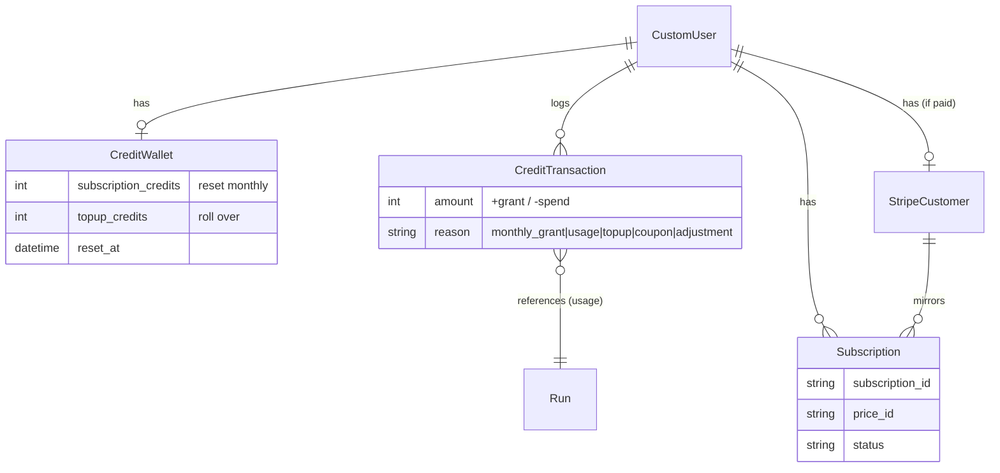
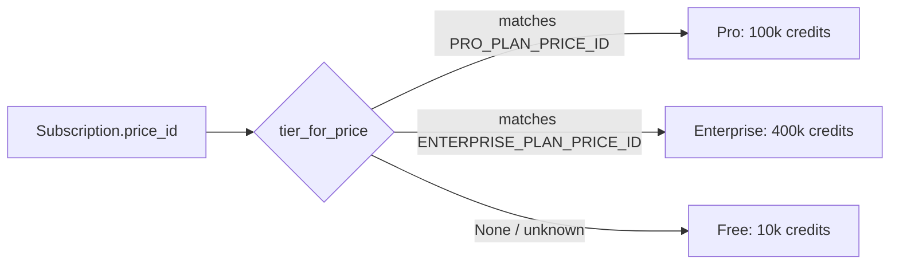
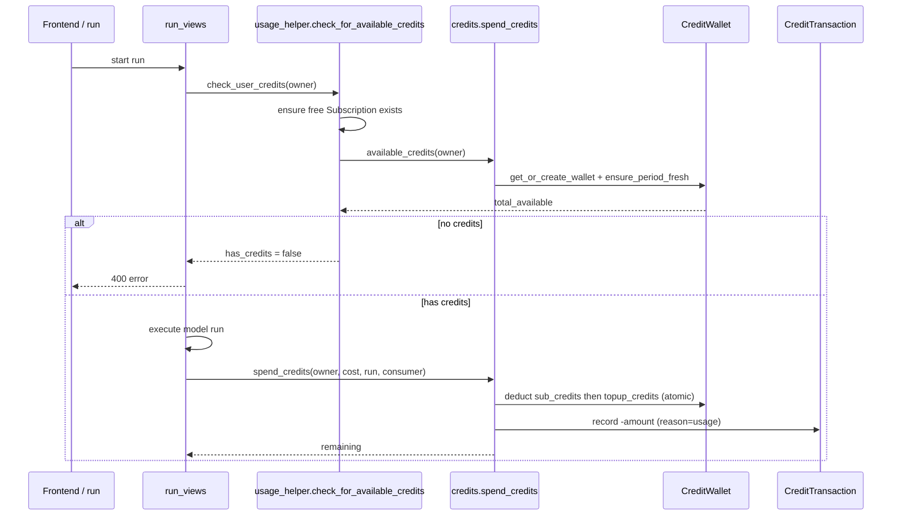
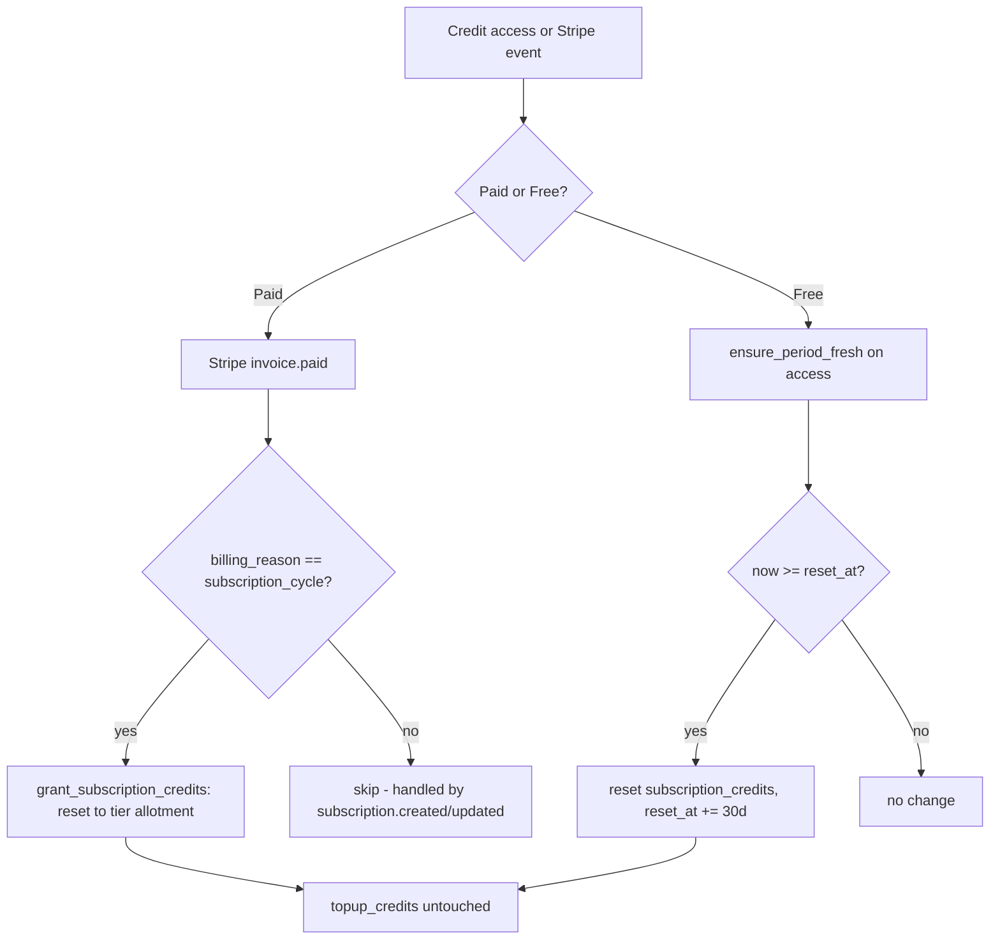
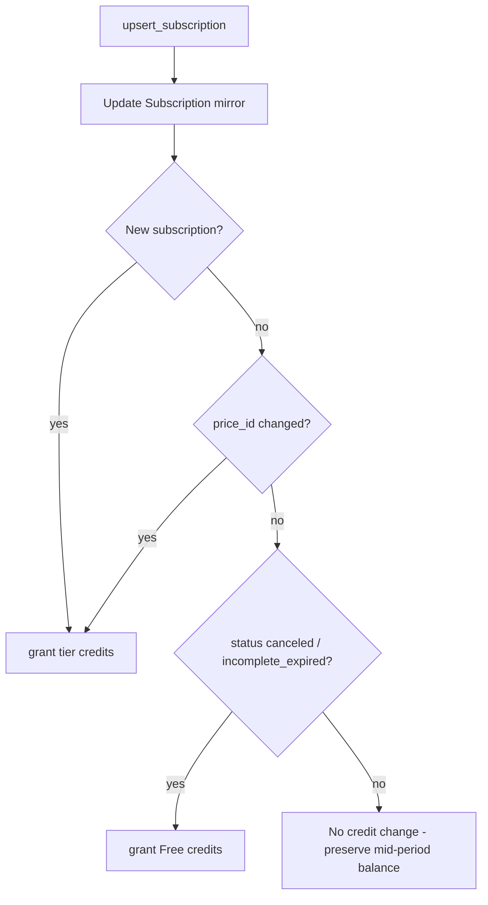

# Subscriptions & Credits — Logic Overview

This document describes how subscriptions, Stripe, and the credit system work after
the wallet migration (see `docs/subscriptions-credits-migration-plan.md`).

## Core concepts

| Concern | Source of truth | Model / location |
|--------|-----------------|------------------|
| Payment & plan status | **Stripe** | mirrored into `Subscription` via webhooks |
| Entitlements (credits/app limits per tier) | **Code** | `TIERS` map in `constants.py` |
| Spendable credits | **Database wallet** | `CreditWallet` (+ `CreditTransaction` ledger) |

- `subscription_credits` reset to the tier allotment each period. **Top-ups never reset.**
- Spending draws from `subscription_credits` first, then `topup_credits`.
- Free = no active Stripe subscription → `TIERS["Free"]`.

## Entity relationships



## Tier resolution



## Credit spend on an AI run



## Monthly reset



## Plan lifecycle & Stripe communication

```mermaid
flowchart TD
    subgraph User actions
      A1[Buy plan] -->|checkout-session| CS[Stripe Checkout]
      A2[Upgrade/Downgrade/Cancel] -->|update-subscription| PORTAL[Stripe Customer Portal]
      A3[Buy top-up] -->|checkout-session payment mode| CS
    end

    subgraph Stripe -> webhooks
      CS --> WH[stripe_webhook]
      PORTAL --> WH
      WH --> E1[customer.subscription.created/updated -> upsert_subscription]
      WH --> E2[customer.subscription.deleted -> revert to Free]
      WH --> E3[invoice.paid -> monthly reset]
      WH --> E4[checkout.session.completed -> grant_topup_credits]
      WH --> E5[customer.deleted -> wipe + reset wallet to Free]
    end

    E1 --> SYNC[Sync wallet tier on create / plan change]
    E2 --> SYNC
    E3 --> RESET[Reset subscription_credits to tier allotment]
    E4 --> TOP[Add topup_credits]
```

## upsert_subscription wallet-sync rule

When a `subscription.created/updated/deleted` event arrives, the wallet is re-granted
**only** when membership materially changes:



Routine updates (e.g. toggling `cancel_at_period_end`) do **not** refill credits;
the monthly reset is driven only by `invoice.paid`.
