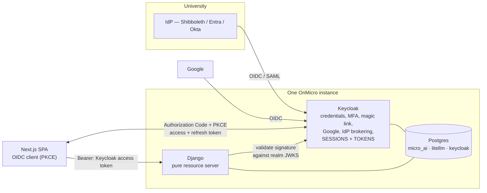
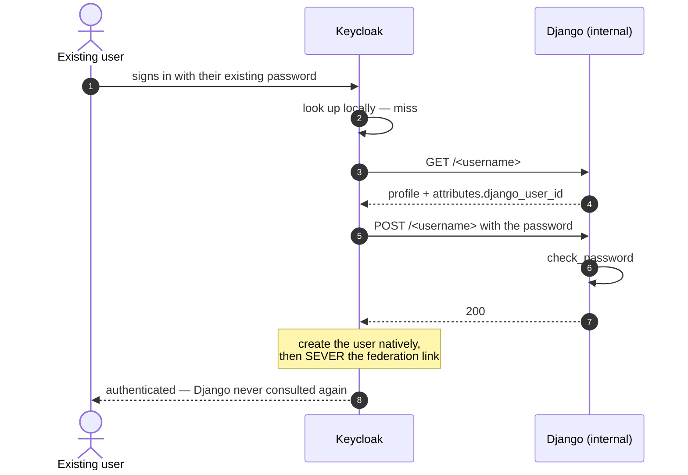

# Keycloak migration

## Architecture at a glance




**Decision: Keycloak owns tokens and sessions. Django becomes a pure resource server.**

The SPA performs Authorization Code + PKCE against Keycloak, holds the resulting tokens, and sends the Keycloak access token as a Bearer header on every API call. Django validates that token against the realm’s JWKS and resolves it to a `CustomUser`. Django mints nothing.

---

## 1. Infrastructure: one Keycloak per instance

**Each OnMicro instance runs its own Keycloak with a single realm, using its own database inside the instance’s existing Postgres.**

```
db (pgvector/pgvector:pg17) ─┬─ micro_ai
                             ├─ litellm      ← existing precedent
                             └─ keycloak     ← new, same pattern
+ keycloak container (~512MB–1GB JVM)
```

---

## 2. Users: storage, source of truth, migration, and sync

**Keycloak owns the credential. Django keeps the row. Neither can be removed.**

Django’s `users_customuser` cannot go away, because 15 models across four apps hold foreign keys to `AUTH_USER_MODEL`:

| App             | Models                                                                                                                                  |
| --------------- | --------------------------------------------------------------------------------------------------------------------------------------- |
| `api`           | `UserAPIKey`                                                                                                                            |
| `collection`    | `CollectionUserJoin`                                                                                                                    |
| `subscriptions` | `StripeCustomer`, `Subscription`, `UserEntitlement`, `CouponUsage`, `CreditWallet`, `CreditTransaction`                                 |
| `microapps`     | `MicroAppUserJoin`, `Run` (`user_id` + `owner_id`), `AppUsageSession`, `RubricBuild`, `UserDashboardAppOrder`, `UserCollectionAppOrder` |

Plus `account_emailaddress`, `socialaccount_socialaccount`, `mfa_authenticator`, `django_admin_log`. Keycloak cannot own those keys.

So the Django row persists — but its **authority** changes:

| Column                             | Today         | After                                                                             |
| ---------------------------------- | ------------- | --------------------------------------------------------------------------------- |
| `password`                         | authoritative | `set_unusable_password()` — dead value, column stays (required by `AbstractUser`) |
| `email`, `first_name`, `last_name` | authoritative | mirror of the ID-token claim, refreshed each login                                |
| `is_active`                        | authoritative | mirror of Keycloak `enabled`                                                      |
| `is_staff` / `is_superuser`        | authoritative | **stays authoritative in Django** — see below                                     |
| `keycloak_sub` _(new)_             | —             | join key; authoritative in Keycloak                                               |

**Django admin stays on local `ModelBackend`.** Superusers keep real passwords as a break-glass path for when Keycloak is unavailable. This means “no credentials in Django” is true for regular users and deliberately false for admins — state it plainly in security reviews rather than letting it be discovered.

### Source of truth: Keycloak, synced by JIT (Just In Time) provisioning only

**Decision: provision from the token Keycloak issued. Never use webhooks.**

### How the two records are linked

```python
# apps/users/models.py
keycloak_sub = models.CharField(
    max_length=36, unique=True, null=True, blank=True, db_index=True
)
```

`sub` is Keycloak’s user UUID — stable for the life of the account, and **unchanged when email or username changes**, which is exactly why it is the key and email is not.

The link is established by an attribute round-trip rather than by email matching. The migration endpoint (below) returns the Django PK as a Keycloak user attribute; a protocol mapper puts it in the ID token; Django receives its own primary key back:

```python
def resolve_user(claims):
    # 1. Already linked — steady state
    user = CustomUser.objects.filter(keycloak_sub=claims["sub"]).first()
    if user:
        return user

    # 2. Migrated user, first login — exact PK match
    user = None
    if pk := claims.get("django_user_id"):
        user = CustomUser.objects.filter(pk=pk).first()

    # 3. Fallback — the only place email is ever a matcher
    if not user:
        email = (claims.get("email") or "").strip().lower()
        if not email or not claims.get("email_verified"):
            raise SuspiciousOperation("provider asserted no verified email")
        user = CustomUser.objects.filter(email__iexact=email).first()

    if user:
        if user.keycloak_sub and user.keycloak_sub != claims["sub"]:
            raise SuspiciousOperation("row already linked to a different Keycloak user")
        user.keycloak_sub = claims["sub"]
        user.save(update_fields=["keycloak_sub"])
        return user

    return jit_create(claims)   # fires user_signed_up → funds credit wallet
```

### Migrating existing users: lazy, at login

**Decision: REST user federation, not a bulk hash import.**

We deploy that JAR — a generic User Storage SPI — and implement **two endpoints in Django**:

| Endpoint           | Purpose                                                                                                |
| ------------------ | ------------------------------------------------------------------------------------------------------ |
| `GET /<username>`  | Returns `{username, email, firstName, lastName, enabled, emailVerified, attributes: {django_user_id}}` |
| `POST /<username>` | Validates the password with `check_password`; 200 if correct                                           |




The user notices nothing. They type the password they have always used.

### New users after cutover

The Django table keeps growing — it must, for the 15 foreign keys. Registration happens in Keycloak; the Django row is created JIT on the user’s first arrival:

1. User registers in Keycloak (or arrives federated from a university IdP)
2. The SPA completes PKCE and makes its first API call bearing a Keycloak access token
3. `KeycloakAuthentication` validates the token; `resolve_user` misses all three lookups → `jit_create`
4. `set_unusable_password()`, `keycloak_sub` set, email and names from claims
5. **Fires `user_signed_up` → funds the credit wallet**

---

## 3. SSO

Keycloak brokers the university IdP. An SSO user ends up with three records, two of them ours:

| Record                                  | Owner          | Created                  |
| --------------------------------------- | -------------- | ------------------------ |
| University account (NetID)              | The university | Long before us           |
| Keycloak user + federated identity link | Our realm      | First broker login       |
| `CustomUser` row                        | Django         | First arrival at OnMicro |

From Django’s side nothing is special — Keycloak issues its own token and `resolve_user` runs unchanged. Django cannot distinguish an SSO user from a password user unless an `idp` claim is deliberately mapped.

### The case that matters: an existing user at a university that enables SSO

Jane holds `jane@rutgers.edu` with 12 micro apps. Rutgers turns on SSO.

- **If she already migrated** — a Keycloak user exists; First Broker Login attaches the IdP link to it; same `sub`; Django matches on `keycloak_sub`. Account intact.
- **If she never logged in** — no Keycloak user exists, so the lookup should fall through to the federation provider, which pulls her from Django with `django_user_id`. The broker link attaches; Django matches on the PK. Account intact.

The migration machinery and the SSO brokering compose: the same provider that migrates passwords also catches SSO users who never migrated.

**Verified against real Keycloak (PR 11):** both outcomes above hold — no duplicate account is ever created, in either order. One nuance the "pulls her from Django with `django_user_id`" phrasing overstates: First Broker Login's account-link re-authentication step does call the federation provider (confirming the "never logged in" lookup genuinely traverses it, not just a coincidence of email matching), but it does not carry `django_user_id` onto the newly-materialized local Keycloak user as a user attribute. The `django_user_id` protocol mapper therefore emits nothing for that user's first post-link token, and `resolve_user` actually lands on the existing `CustomUser` row via its verified-email fallback branch, not the `django_user_id` branch — same result, slower path. If Django's email ever drifts from Keycloak's (e.g. a manual edit on one side only), this fallback stops being reliable; the fast path staying dark is a latent gap, not yet a bug-fix PR.

**Also verified:** `sso_only` enforcement (Keycloak's built-in "Identity Provider Redirector" browser-flow execution, present but unconfigured by default) does force every login straight to the broker, skipping the password form entirely, once a realm sets its `defaultProvider` config — confirming it's realm-configurable and off by default, as stated above.

### Protocol

OIDC and SAML are both first-class in Keycloak, configured identically from our side.

---

## 4. Google auth

Configuration, not code: a Google identity provider in the realm, client ID and secret from Google Cloud Console, redirect URI pointing at Keycloak’s broker endpoint.

Two things carry over unchanged in substance:

- **Auto-link only on a verified email.** Google asserts `email_verified`; the First Broker Login flow must be configured to require it. Failing open here is trivially exploitable.
- **`sso_only` must be enforced on this path too.** Enforcement is realm/organization configuration, but it must be explicitly configured; it is not a default.

## 5. Open questions

1. Should an LTI launch provision an account? Under Keycloak it could JIT-create from the LTI claim. Answer - yes
